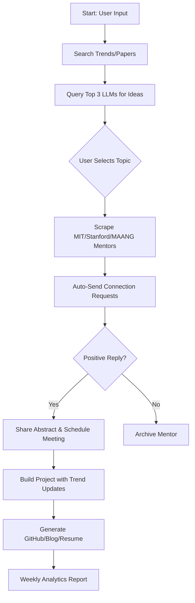

Here’s a structured plan for your project documentation, flowchart, and GitHub setup:

---

### **1. GitHub Repository Structure**
Create a repository with the following structure:

```
AI-Project-Agent/
├── docs/                        # Project documentation
│   ├── Project_Design_Doc.md    # High-level design document
│   ├── Flowchart.xml            # Draw.io/Mermaid flowchart (system workflow)
│   └── Ethical_Guidelines.md    # Privacy, compliance, and ethical considerations
├── src/                         # Source code
│   ├── search_engine_scraper/   # Auto-search for trends, papers, LLMs
│   ├── llm_integration/         # Hugging Face/OpenAI/Gemini API integration
│   ├── mentor_finder/           # LinkedIn/ResearchGate scraping & outreach
│   ├── project_manager/         # GitHub/Blog/Resume automation
│   └── trend_analyzer/          # Weekly AI trend analysis (Twitter/YouTube/HF)
├── scripts/                     # Automation scripts
│   ├── mentor_outreach.py       # LinkedIn connection requests
│   ├── llm_prompt_generator.py  # Topic generation via LLMs
│   └── trend_scraper.py         # Scrape trending AI tools
├── data/                        # Stored data
│   ├── llm_responses/           # Top 3 LLM suggestions (JSON/CSV)
│   ├── mentor_profiles/         # MIT/Stanford/MAANG mentor contacts
│   └── trends/                  # Weekly AI trend reports
├── results/                     # Outputs
│   ├── project_abstract.md      # Generated abstract for mentors
│   ├── blog_posts/              # Auto-generated blog drafts
│   └── resume_updates.md        # Resume lines for the project
├── utils/                       # Utilities
│   ├── config.yaml              # API keys, platform credentials
│   ├── templates/               # Email/LinkedIn message templates
│   └── logger.py                # Logging module
├── tests/                       # Unit/integration tests
├── .github/                     # CI/CD workflows
├── requirements.txt             # Python dependencies
├── README.md                    # Setup guide, overview, usage
└── LICENSE
```

---

### **2. Documentation**
#### **2.1 README.md**
- **Project Overview**: Explain the AI agent’s purpose (automated project creation, mentor search, trend analysis).
- **Setup Guide**: 
  - Install dependencies: `pip install -r requirements.txt`.
  - Configure `config.yaml` with API keys (OpenAI, Hugging Face, LinkedIn).
  - Run `main.py` to start the agent.
- **Usage**: 
  - Command-line arguments (e.g., `--trends weekly`, `--mentor_search mit`).
  - Example prompts for LLMs.

#### **2.2 Technical Design Document**
- **Modules**:
  1. **Search Engine Scraper**: Uses SerpAPI/BeautifulSoup to find papers, LLMs, and trends.
  2. **LLM Integrator**: Queries GPT-4/Claude/Llama-3 for project ideas.
  3. **Mentor Finder**: Scrapes LinkedIn/ResearchGate for MIT/Stanford/MAANG experts.
  4. **Communication Manager**: Sends templated messages and tracks responses.
  5. **Project Generator**: Creates GitHub repos, blogs, and resume entries.
- **Workflow**: Flowchart steps (see below).

#### **2.3 Ethical Guidelines**
- Compliance with LinkedIn’s ToS (avoid aggressive scraping).
- GDPR/CCPA compliance for mentor data storage.
- Transparency in AI-generated content (blog/resume).

---

### **3. Flowchart (Mermaid.js)**
Embed this in your `README.md`:



---

### **4. Key Scripts**
#### **4.1 Mentor Outreach Automation (`mentor_outreach.py`)**
- Uses LinkedIn API/Selenium to:
  - Scrape profiles from top universities/companies.
  - Send connection requests with templated messages.
  - Track responses (positive/negative).

#### **4.2 LLM Topic Generator (`llm_prompt_generator.py`)**
```python
from openai import OpenAI
client = OpenAI(api_key="YOUR_KEY")

def generate_ideas(prompt):
    response = client.chat.completions.create(
        model="gpt-4",
        messages=[{"role": "user", "content": prompt}]
    )
    return response.choices[0].message.content
```

#### **4.3 Trend Analyzer (`trend_scraper.py`)**
- Scrapes Hugging Face/Arxiv/Twitter weekly for trending tools (e.g., AI agents, RAG).

---

### **5. Deliverables for Mentor**
1. **GitHub Link**: `github.com/yourusername/AI-Project-Agent`
2. **Documents**:
   - `Project_Design_Doc.md`: Architecture, modules, ethics.
   - `Flowchart.png`: Visual workflow.
   - `Ethical_Guidelines.md`: Compliance strategies.
3. **Demo Video**: Short clip showing agent generating a project and contacting mentors.

---

### **6. Ethical Considerations**
- Avoid spamming mentors; limit connection requests to 10/week.
- Store mentor data securely (encrypted JSON).
- Clearly state AI-generated content in blogs/resume.
